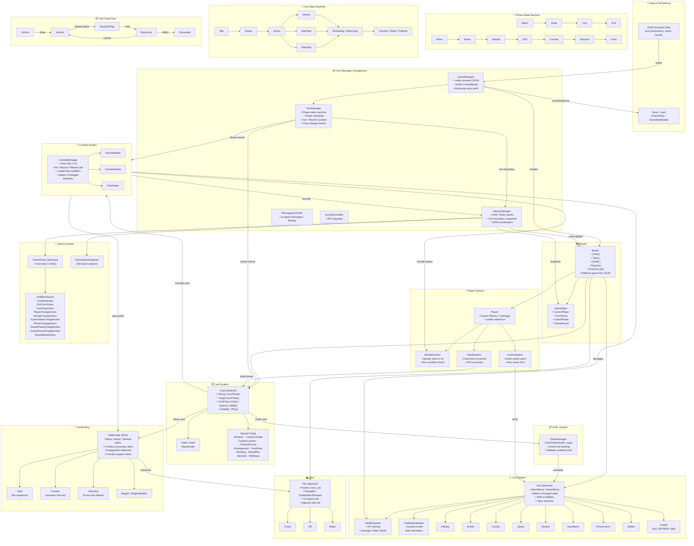

# Battle of Legends — Software Architecture



---

## Layer Summary

| Layer | Responsibility |
|-------|---------------|
| **Data / Persistence** | JSON scenarios, save/load serialisation |
| **Core Managers** | GameManager, TurnManager, HistoryManager, MessageController, SoundController |
| **Board** | Central model — owns all game objects |
| **Tile System** | Hex grid, passability, adjacency |
| **Unit System** | Stats, health, state machine, abilities |
| **Player System** | Morale, hand size, action points |
| **Card System** | Timing, validation, play effects |
| **Combat System** | Dice, hit/wound/retreat resolution |
| **Order System** | Leader order giving and limits |
| **Pathfinding** | BFS hex movement, attack/retreat paths |
| **History** | Undo/redo via snapshot + command pattern |

## Key Design Patterns

- **Singleton** — GameManager, TurnManager, CombatManager, OrderManager, PathFinder, HistoryManager
- **Abstract Factory** — Unit/Card/Tile types instantiated via reflection from JSON names
- **State Machine** — TurnPhase, GamePhase, UnitState, CardState all modelled as explicit state machines
- **Snapshot + Command** — HistoryManager stores full-board snapshots at turn boundaries alongside reversible GameAction objects
- **Event-Driven** — TurnManager fires events on every phase/player/hand/action change; Board components subscribe
- **Hexagonal Grid** — Even/odd row offset coordinate system with 6-directional movement via Direction enum
```
